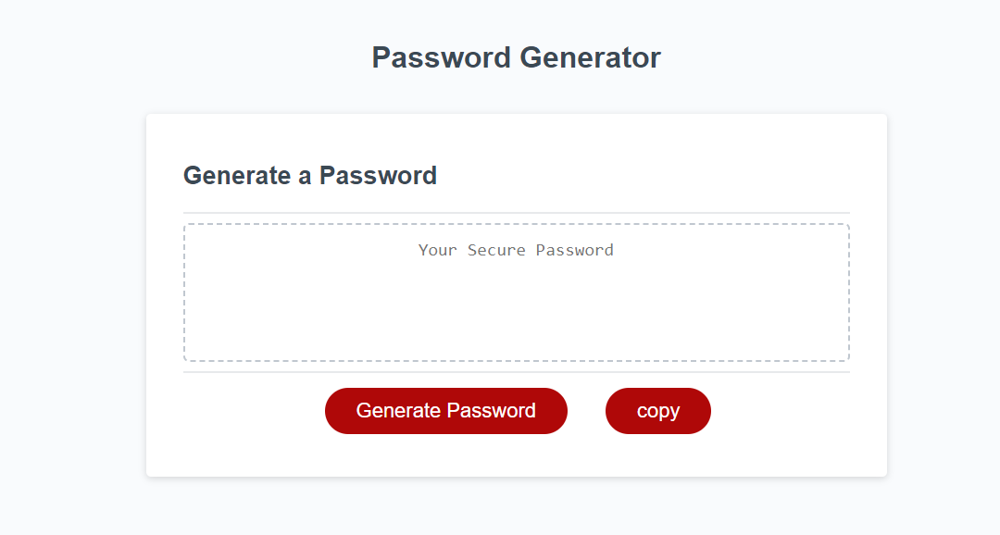

# Random-password-generator

## About

    This is a random passowrd generator. When the user opens the 
website they will be prompted to input what character sets 
they would want involved in the password generated!

## Function 

You can choose how long your password is
You can choose what characters you want
You can generate a password to be used for any functional purpose 

## Screenshot

## Link

 [file:https://ttieman.github.io/Random-password-generator/](doc:linking-to-pages#https://ttieman.github.io/Random-password-generator/)

 ## License

    MIT

## Citing Credit

 Web3 schools was used for referencing javascript elements while building this page!

 [https://www.w3schools.com/](doc:linking-to-reference#https://www.w3schools.com/)

## Wrapping Up 

This is my First project building with JavaScript

#

I used this project to further my understanding and reinforce my skills with JavaScript. This was a lot more complex than I originally exprected and furthered my understanding and utilization of computational thinking!